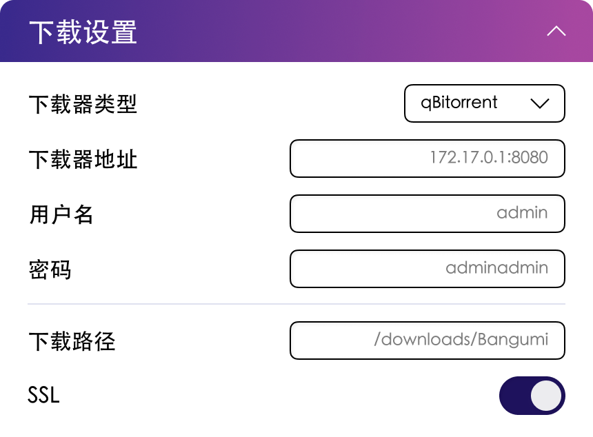

# 下载器设置

## WebUI 设置

{width=500}{class=ab-shadow-card}

<br/>

- **Downloader Type** 为下载器类型，目前支持 qBittorrent 和 PikPak 下载器。
- **Host** 为下载器地址。[1](#下载器地址)
- **Download path** 为映射的下载器下载路径。[2](#下载器路径问题)
- **SSL** 为下载器是否使用 SSL。

## 常见问题

### 下载器地址

::: warning 注意
请不要直接使用 127.0.0.1 或 localhost 作为下载器地址。
:::

由于 AB 在官方教程中是以 **Bridge** 模式运行在 Docker 中的，如果你是用 127.0.0.1 或者 localhost 那么 AB 将会把这个地址解析为自身，而非下载器。
- 如果此时你的 qBittorrent 也运行在 Docker 中，那么我们推荐你是用 Docker 的 **网关地址：172.17.0.1**。
- 如果你的 qBittorrent 运行在宿主机上，那么你需要使用宿主机的 IP 地址。

如果你以 **Host** 模式运行 AB，那么你可以直接使用 127.0.0.1 代替 Docker 网关地址。

::: warning 注意
Macvlan 会隔离容器的网络，此时如果你不做额外的网桥配置将无法访问同宿主机的其他容器或者主机本身。
:::

### 下载器路径问题

AB 中配置的路径只是为了生成对应番剧文件路径，AB 本身不对路径下的文件做直接管理。

**下载路径** 到底写什么？

这个参数只要和你 **下载器** 中的参数保持一致即可。
- Docker：比如 qB 中是 `/downloads` 那就写 `/downloads/Bangumi`，`Bangumi`可以任意更改。
- Linux/macOS：如果是 `/home/usr/downloads` 或者 `/User/UserName/Downloads` 只要在最后再加一行 `Bangumi` 就行。
- Windows：`D:\Media\`, 改为 `D:\Media\Bangumi`

## `config.json` 中的配置选项

在配置文件中对应选项如下：

配置文件部分：`downloader`

| 参数名      | 参数说明        | 参数类型 | WebUI 对应选项  | 默认值                |
|----------|-------------|------|-------------|--------------------|
| type     | 下载器类型       | 字符串  | 下载器类型       | qbittorrent 或 pikpak |
| host     | 下载器地址       | 字符串  | 下载器地址       | 172.17.0.1:8080    |
| username | 下载器用户名      | 字符串  | 下载器用户名      | admin              |
| password | 下载器密码       | 字符串  | 下载器密码       | adminadmin         |
| path     | 下载器下载路径     | 字符串  | 下载器下载路径     | /downloads/Bangumi |
| ssl      | 下载器是否使用 SSL | 布尔值  | 下载器是否使用 SSL | false              |

## PikPak 云盘下载器

PikPak 是一种云盘下载方案，作为 qBittorrent 的替代选择。使用 PikPak 时，文件会下载到云端，需要配合 rclone 挂载才能让媒体服务器（如 Jellyfin/Plex）访问。

### 配置示例

```json
{
    "downloader": {
        "type": "pikpak",
        "username": "your_pikpak_email@example.com",
        "password": "your_pikpak_password",
        "path": "/downloads/Bangumi"
    }
}
```

### 参数说明

| 参数名      | 参数说明           | 参数类型 | 默认值                |
|----------|----------------|------|---------------------|
| type     | 下载器类型          | 字符串  | pikpak              |
| username | PikPak 账号邮箱     | 字符串  | -                   |
| password | PikPak 账号密码     | 字符串  | -                   |
| path     | 媒体服务器访问的路径     | 字符串  | /downloads/Bangumi  |

::: tip 注意
使用 PikPak 时，`host` 和 `ssl` 参数会被忽略。
:::

### rclone 挂载配置

为了让媒体服务器能够访问 PikPak 云盘中的文件，需要使用 rclone 将云盘挂载到本地：

1. 安装 rclone 并配置 PikPak 后端：
   ```bash
   rclone config
   # 选择 "New remote" -> 输入名称（如 pikpak）
   # 选择 PikPak 类型并输入账号密码
   ```

2. 挂载云盘到本地目录：
   ```bash
   rclone mount pikpak: /mnt/pikpak --vfs-cache-mode full --daemon
   ```

3. 将 `path` 配置为挂载点下的 AutoBangumi 目录（如 `/mnt/pikpak/AutoBangumi`），或者在媒体服务器中直接配置挂载点路径。

::: warning Docker 环境
如果在 Docker 中运行 AB，需要将 rclone 挂载点通过 volume 映射到容器内，或在容器内运行 rclone。
:::


